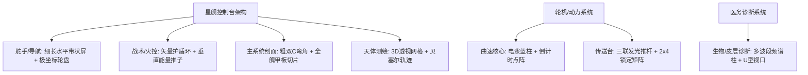

# LCARS 视觉设计规范与色彩运用原则

> **文档状态**：规范标准文档 (Official Reference)  
> **数据来源**：基于对《星际迷航：下一代》(TNG) 与《航海家号》(VOY) 共计 **1,149 张经典 LCARS 界面截帧与剧照** 的全量像素级解析与多模态视觉提取。  
> **适用范围**：`:lcars-ui` 组件库设计、Android Jetpack Compose 布局容器、色彩 Token 配置与应用界面开发。

---

## 一、 核心设计哲学：色彩即语法 (Color as Syntax)

在 Michael Okuda 创立的 LCARS（Library Computer Access and Retrieval System）视觉体系中，**色彩不是用于美化的“装饰”，而是界面的“物理语法”与“视觉力学”**。

LCARS 面向 24 世纪星舰的高信息密度与毫秒级决策场景，其核心原则为：
1. **绝对纯黑基底 (`#000000`)**：无投影、无玻璃拟物、无渐变，将所有发光单元规整为悬浮光砖。
2. **结构与交互严格解耦**：不可触控的结构骨架与可交互的操作按键在色彩和形态上有严格区隔。
3. **高对比背光发光板逻辑**：着色几何块为“发光体”，其内部文字为“遮光印刻”，固定为纯黑字。
4. **节拍律动防视疲劳**：依靠严格的冷暖波浪交错打破单调感，提升盲操定位效率。

---

## 二、 六大核心色彩运用语法原则

```
┌─────────────────────────────────────────────────────────────┐
│                   LCARS COLOR SYNTAX LAWS                   │
├─────────────────────────────────────────────────────────────┤
│ 1. 骨架统一 (Spine Monolith)   : Elbow与延伸主梁必为同一结构色    │
│ 2. 邻接异色 (No Same Adjacent) : 物理相邻单元严禁同色粘连        │
│ 3. 节拍交错 (Wave Cadence)     : 纵向单元遵循冷暖/明暗波浪交错    │
│ 4. 嵌套凹陷 (Concentric Depth) : 外浅内深，用纯色落差模拟3D纵深   │
│ 5. 发光遮墨 (Luminous Body)    : 实色块内文字必为纯黑遮光印刻     │
│ 6. 刺破劫持 (Color Intrusion)  : 警报与动作以单点突变打破静态节拍 │
└─────────────────────────────────────────────────────────────┘
```

### 1. 结构锚定与骨架连续原则 (Structural Anchoring & Continuity)
* **骨架单一性公理 (Monolithic Skeleton Rule)**：
  Elbow（L 型弯角）与从其水平或垂直延伸出的主干梁（`LcarsBar`）属于“承重骨架层”，**必须使用同一种基础色贯通**。严禁主横梁在中途无故切换颜色，确保操作视窗（Viewport）拥有坚固、连续的视觉边界。
* **结构色 vs 交互色分层 (Structure-Interaction Decoupling)**：
  骨架色通常采用中性、低侵略性色调（如冷紫蓝、沙褐色、淡灰黄），代表不可点击的支撑体系；紧邻骨架的可交互按键必须在色相或明度上产生显著差异。

### 2. 邻接防粘连与三维节奏律动原则 (Adjacent Contrast & Rhythm)
* **相邻绝对异色律 (Zero Adjacent Same-Color Axiom)**：
  任何在空间上物理相邻、仅隔着标准 $4\text{dp}$ 缝隙的两个色块，**绝对禁止使用同一种颜色**，防止色块在视觉上熔断粘连。
* **冷暖与明度的波浪交错 (Wave Cadence Alternation)**：
  沿 Elbow 垂直排布的按键列，必须遵循“高明度（浅色）与低明度（深色）”、“冷色（蓝/紫）与暖色（黄/橙）”的周期性波浪交错，为连续按键赋予天然的视觉节拍，防止眼球扫视疲劳。
* **三元/四元周期循环 (Triadic / Quadratic Periodicity)**：
  单列按键通常以 3~4 种固定色阶构成循环闭环（如：`基准冷色 -> 浅明度过渡色 -> 饱和暖色 -> 浅明度过渡色`）。

### 3. 嵌套同心对比与伪 3D 纵深原则 (Nested Concentric Depth)
* **内外双弯角明度落差 (Concentric Depth Inversion)**：
  当出现双层 Elbow 嵌套时（Outer Elbow 包裹 Inner Elbow），**内外层必须采用强对比异色**。
* **外浅内深 / 外冷内暖法则**：
  外层骨架采用高明度或中性冷色（定义外壳物理边界）；内层嵌套弯角采用**深邃内敛的暗调色（如深酒红、深紫罗兰）**充当视口内衬。Okuda 利用这种 2D 纯平色阶差，**在无阴影无渐变的前提下模拟出视口向内凹陷沉降的三维空间感**。

### 4. 语义编码与区域封闭原则 (Semantic Zoning & Local Coherence)
* **色彩映射星舰系统域 (Domain-to-Color Mapping)**：
  * **传感器与科学域**：以冷系色调为主（电光蓝、青色、薄荷绿）。
  * **动力与战术武器域**：以高能高警觉色为主（琥珀金、铬黄、橙红）。
  * **环境与辅助系统域**：以中性过渡色为主（米褐、淡紫、桃褐）。
* **组内单色聚合，组间强色突变 (Intra-group Cohesion, Inter-group Rupture)**：
  同属一个子系统（如“护盾调频”）的按键保持同色系；切换至另一子系统（如“光子鱼雷”）时立即跳变至截然不同的色系，充当无形的逻辑分割线。

### 5. 纯黑基底与背光印刻原则 (Pure Black Contrast & Light-Grip)
* **绝对纯黑绝缘体 (Absolute Black as Spatial Insulator)**：
  背景必须是 100% 纯黑（`#000000`），作为物理绝缘体将发光单元切分为独立光砖。
* **实色块“背光遮墨”印刻机制 (Black Inscription on Luminous Body)**：
  实色块内部文字**一律固定为纯黑（`#000000`）**。实色块是“发光板”，文字是“遮光印墨”，保证在任何剧烈晃动与低照度环境下拥有最高光学辨识度。
* **悬浮线框/文字色彩继承**：
  悬浮在纯黑背景上的坐标网格与遥测数字，必须继承相邻最近的骨架色或状态色。

### 6. 静态和谐与动态侵入原则 (Static Harmony vs Dynamic Intrusion)
* **待机平衡态 (Equilibrium in Neutral State)**：
  正常巡航时色彩处于低饱和、对称的和谐状态。
* **单点刺破式注意力劫持 (Single-Point Attention Hijacking)**：
  当发生触发、警报或锁定事件时，全屏不进行无意义的大面积泛滥闪烁，而是**令与 Elbow 紧邻的特定关键按键突变为高饱和警报红（`#FF1A35`）或强光琥珀（`#FF8800`）**，利用色彩重力在 0.1 秒内强制捕获操作员视线。

---

## 三、 Elbow 及其相邻单元空间排布规则

```
         [ 1. 横向延伸梁 / 嵌梁徽标 (Horizontal Rail & Badge) ]
   ┌───────────────────────────────────────────────┬────────────┐
   │                  ELBOW 主弯角                 │  LcarsBar  │ ──> [ 4. 梁端封头 (End Cap) ]
   │ (Top-Left / Bottom-Left Structural Corner)    └────────────┘
   ├───┬───────────────────────────────────────────
   │   │  [ 3. 内层嵌套弯角 / 视口内衬 (Nested Elbow / Viewport Liner) ]
   │   │  ┌──────────────────────────────
[2.│ B │  │
 纵│ U │  │  [ 中央视口数据区 / 3D网格 / 遥测图表 (Central Viewport) ]
 向│ T │  │
 按│ T │  │
 键│ O │
 列│ N │
   │ S │
   └───┴──────────────────────────────────────────
```

| 相邻位置 | 空间几何关系 | 色彩排布规则 | 典型设计模式 |
| :--- | :--- | :--- | :--- |
| **1. 横向延伸梁** | 从 Elbow 水平臂向右延伸 | **100% 继承 Elbow 基准色**，保持结构梁的连续性 | 冰蓝弯角延伸出冰蓝主梁 |
| **2. 嵌梁徽标** | 镶嵌在横向梁外侧或中段 | **从横梁色中强行切出跳色**（通常为明黄、米白） | 冰蓝梁上嵌入柠檬黄 `LCARS` 药丸徽标 |
| **3. 纵向按键列** | 紧贴 Elbow 竖向立柱下延 | **波浪交错循环**，首个按键必须与 Elbow 异色 | Elbow淡紫 $\rightarrow$ 首键琥珀金 $\rightarrow$ 次键浅杏仁 $\rightarrow$ 冰蓝 |
| **4. 内层嵌套弯角** | 贴合外弯角内侧半径延伸 | **绝对异色，外浅内深**，模拟视口内陷凹槽 | 外层冷紫蓝 (`#848EBE`) 嵌套内层深酒红 (`#90263F`) |
| **5. 梁端封头** | 横梁末端终结处 | 若为纯结构封顶则同色；若为动作触发键则切换为高光暖色 | 灰蓝横梁末端带有琥珀橙半圆盖帽按键 |

---

## 四、 时代色板对照表 (TNG vs VOY Era Color Palettes)

### 1. TNG 时代经典色板 (The Next Generation, 2360s)
强调温暖、典雅与未来舒适感，以金黄、米褐、淡紫为主基调：

| 语义角色 | 颜色名称 | 精确 HEX | 视觉比例 | 典型用途 |
| :--- | :--- | :--- | :--- | :--- |
| **Primary Action** | Okuda Amber / Gold | `#FF9900` / `#F5C542` | ~25% | 主控制按键、高亮指令、战术充能 |
| **Structure Secondary**| Auxiliary Tan / Beige | `#CC9966` / `#D9A07B` | ~20% | 次要侧栏、辅助框架连接梁 |
| **Spine Anchor** | Lilac / Violet | `#9999CC` / `#8080C0` | ~20% | 主框架弯角、系统核心底座 |
| **Tactical / Alert** | Salmon / Coral Red | `#FF6633` / `#E05A36` | ~10% | 战术警戒、力场隔离、模式切换 |
| **Telemetry Chart** | Phosphor Green | `#33FF33` / `#42F58A` | ~5% | 动态遥测垂直多柱频谱图、扫描线 |
| **Alert Matrix** | Red Alert Matrix | `#FF1A35` | ~5% | 紧急倒计时点阵、一级红色警报 |
| **Canvas Base** | Pure Black | `#000000` | 100% | 所有界面无缝纯黑底色 |

---

### 2. VOY 时代冷色高对比色板 (Voyager / DS9, 2370s)
显著向高对比度冷色调倾斜，蓝紫与电光青色系占比飙升至 30% 以上：

| 语义角色 | 颜色名称 | 精确 HEX | 视觉比例 | 典型用途 |
| :--- | :--- | :--- | :--- | :--- |
| **Primary Spine** | Electric / Ice Blue | `#6C88D6` / `#8CAEE6` | ~30% | VOY 标志性主弯角与外围骨架 |
| **Nested Liner** | Plum / Wine Burgundy | `#90263F` / `#8E3D64` | ~15% | 嵌套内弯角、分子/医务视口内衬 |
| **Astrometric Grid** | Astrometric Navy | `#2C4070` / `#305090` | ~15% | 3D 空间测绘坐标网格、极坐标轮盘 |
| **Shield / Glow** | Tactical Cyan | `#50E0F0` / `#55D8EB` | ~10% | 护盾能量发光环、动态坐标文字 |
| **Command Accent** | Apricot / Bright Gold | `#FFAA55` / `#FF9944` | ~15% | 高频触发按键、主要模式选择 |
| **Sub-function** | Ice Mint / Sage | `#CAE8DC` / `#DCE8E0` | ~10% | 刻度标尺、次级功能操作键 |

---

## 五、 星舰控制台布局与功能映射 (Layout vs Function Matrix)



---

## 六、 对 Jetpack Compose `:lcars-ui` 的架构落地指导

### 1. 声明式色彩节拍分配器 (Cadence Rhythm Provider)
避免在 UI 代码中手动硬编码按键颜色，提供基于规则的自动着色 Scope：

```kotlin
// 1. 结构色彩序列定义
val LocalLcarsCadence = compositionLocalOf {
    listOf(
        LcarsColors.monoAmber,
        LcarsColors.auxiliaryTan,
        LcarsColors.violet,
        LcarsColors.auxiliaryTan
    )
}

// 2. 在 Elbow 容器内自动规避同色并形成波浪节拍
@Composable
fun LcarsElbowColumn(
    elbowColor: Color,
    modifier: Modifier = Modifier,
    content: @Composable LcarsButtonColumnScope.() -> Unit
) {
    // 内部自动过滤掉与 elbowColor 相同的颜色，确保首个按键与 Elbow 产生强对比
}
```

### 2. 双层嵌套 Elbow 组件规范
扩展 `LcarsElbow`，支持 `nestedColor` 属性，一次性绘制符合外浅内深几何半径的双层弯角。

### 3. 文字排版强制规则
`LcarsText` 在实色块容器内部强制使用 `Color.Black` + `Uppercase`，对齐方式默认为 `Alignment.CenterEnd`（靠右对齐）。

---

## 七、 LcarsElbowFrame 构件几何与物理形态硬约束

在 `:lcars-ui` 核心骨架容器 `LcarsElbowFrame` 及其直接下属构件中，必须严格贯彻以下 4 条物理级硬约束：

### 1. 立柱按键形态硬约束 (Spine Button Rectangle Rule)
* **规则**：`spineSlot`（左立柱）下属的所有指令色块与按键，**其形状严格限定为直角矩形（`RoundedCornerShape(0.dp)`）**。
* **禁忌**：严禁在立柱柱体内使用 `Pill`（药丸两端圆角）、`BlockStart`（左半圆角）或 `BlockEnd`（右半圆角）等异形，确保立柱左侧边缘自弯角垂直切点向下保持绝对平齐连续。

### 2. 首个按键起步位置几何解耦 (Elbow Drop Clearance Rule)
* **规则**：立柱首个按键的起始 Y 坐标由 `LcarsElbowFrame` 的**固有弯角垂直梁高（`elbowHeight`）**独立决定，**严禁与子级按键自身的尺寸高度产生函数绑定**。
* **设计基准**：
  * **Compact 紧凑横屏**：`elbowHeight = 90.dp`；
  * **Wide 宽屏横屏**：`elbowHeight = 116.dp`；
  * **Portrait 竖屏**：`elbowHeight = 64.dp`；
  保证弯角垂直梁向下延伸出充沛的实体缓冲带，杜绝首个按键紧贴外圆弧落点产生局促感。

### 3. ElbowFrame 专属间隙模数律 (ElbowFrame 4dp Internal Gap Rule)
* **规则**：仅针对 `LcarsElbowFrame` 内部的核心装配交界，缝隙严格锁定为 `LocalLcarsSpacing.current.gapStandard`（**4.dp**）：
  1. 弯角右端 $\rightarrow$ 顶部横梁 `railSlot` 间距（$4\text{dp}$）；
  2. 弯角底端 $\rightarrow$ 立柱 `spineSlot` 首项起步间距（$4\text{dp}$）；
  3. 立柱 `spineSlot` 内部子项垂直间距（$4\text{dp}$）；
  4. 弯角内弧 $\rightarrow$ 内部视口 `content` 安全避让间距（$4\text{dp}$）。

### 4. 标题切口横梁单一材料同色律 (Monochromatic Cutout Beam Rule)
* **规则**：`LcarsCutoutBar` 属于同一根水平结构主梁，其文字切口左侧段（Start Segment）与右侧段（End Segment）**色彩必须保持绝对一致**，禁止跨文字切口发生左右颜色跳变。
* **色彩应用**：色彩交替律动仅允许出现在垂直指令柱（Spine Column）或独立的从属分段梁（`LcarsSegmentedBar`）上。

